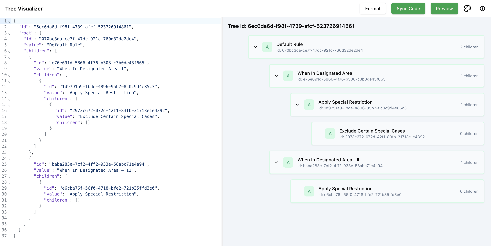
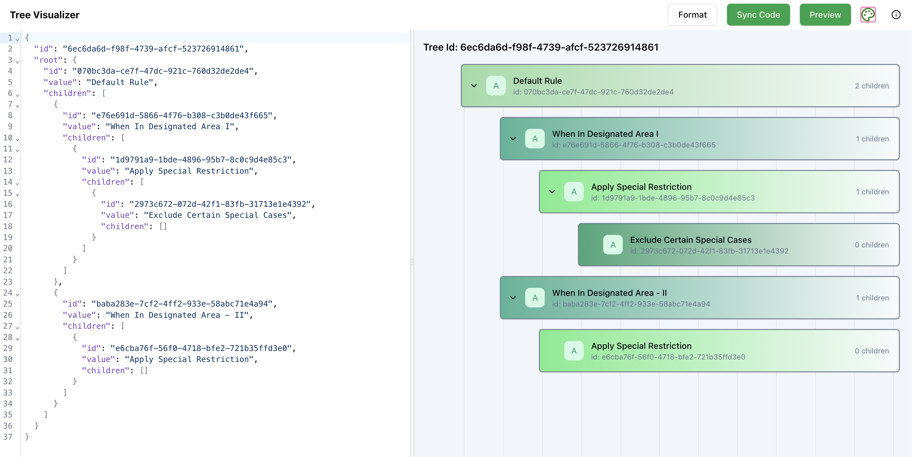

<p align="center">
  <a href="https://github.com/William9923/tree-visualizer">
    
    <h2 align="center">Tree Visualizer</h2>
  </a>
</p> 
<p align="center">A Proof of Concept application built using react to show interaction that can be done on tree based rule engine on JSON code as input.</p>

## ✨ Overview 

Tree Visualizer is a React application that allows users to visualize tree structures based on JSON input. The application provides a tree editor and a tree visualizer to help users create and view hierarchical data structures easily.

### Current Features
- Drag and drop tree node on rule engine
- Preview tree based on JSON code
- Sync JSON code from visualized tree
- Format JSON code (2 space per tab)
- Color hinting on tree based on depth

## 🚀 Quick start / setup

**Run the application locally**

Step 1: Clone The Repo

Fork the repository, then clone the repo locally by running:

```bash
git clone https://github.com/your-username/tree-visualizer.git
```

Step 2: Install Dependencies

Navigate to the project directory:

```bash
cd tree-visualizer
```

Step 3: Install all the dependencies using yarn:

```bash
npm install -g yarn
yarn install
```

Use the node version defined in `.nvmrc`. If you use version manager such as `nvm`, you can use `nvm install` to install and use the correct node version

Step 4: Start Development Server

```bash
npm run dev
```

After running the development server, the application should be running on https://localhost:5173.

## 📸 Screenshot

<p align="center"> <video width="600" controls> <source src="docs/demo.mov" type="video/mp4"> Your browser does not support the video tag. </video> </p>






## 🔮 Future  Plan
<input disabled="" type="checkbox"> Add more details on each rule engine node components (conditions and rule content)
<input disabled="" type="checkbox"> Add more code editor hint (such as line bar) for the tree editor section
